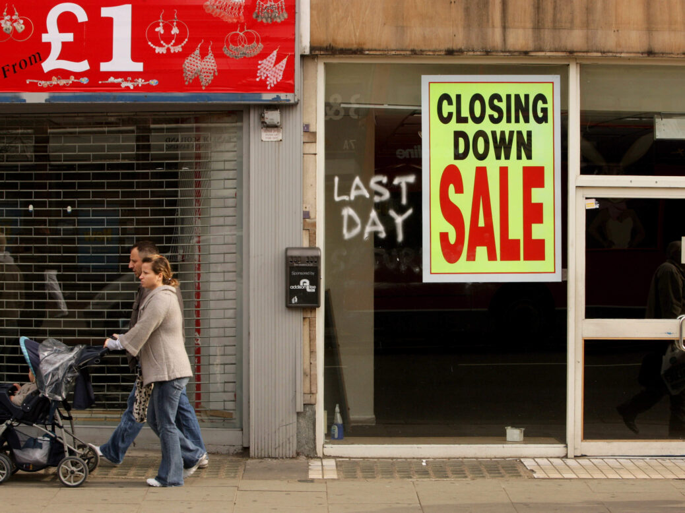

# **The Death of the High Street: And How Digital Infrastructure Can Save It**

*By Jake Ngatchu*

People often talk about the high street as if it died overnight. The truth is more complicated. It did not collapse because people stopped caring about physical retail. It collapsed because the digital world evolved faster than local businesses could adapt, and the infrastructure behind most high street shops never modernised.

The high street was built on footfall, manual workflows, isolated systems and slow decision making. The modern economy is built on data, automation, real time visibility and customer experience. One environment kept moving forward. The other stayed still. The result is obvious.

The high street is not dead because customers disappeared. It is struggling because the systems behind it were never designed to compete with platforms that can test, optimise, personalise and fulfil at scale.

This is not a retail problem. It is an infrastructure problem.

Physical shops are still powerful. People still want to touch products, talk to staff and experience something real. What is missing is the connection between the physical environment and the digital one. Local businesses do not fail because of poor products. They fail because they cannot see their numbers clearly, they cannot scale their processes, and they cannot react fast enough to change.

That is where digital infrastructure becomes the difference between decline and revival.

When a small business has a modern system behind it, everything changes. A simple checkout flow becomes a complete customer journey. A local shop becomes an online store with predictable margins and repeatable operations. Stock on a shelf becomes data that guides purchasing, pricing and marketing. A customer who walks in once becomes someone you can reach again through automation, segmentation and loyalty tools.

The future of the high street is not about replacing physical retail. It is about enhancing it with the same intelligence and efficiency that online businesses use daily.

Imagine a high street where every store is powered by a unified digital backend. Real time sales. Automated fulfilment. Integrated payment systems. Product authentication. Dynamic pricing. Simple logistics. Personalised promotion. A high street where businesses share data about demand and footfall, and where digital systems make operations as efficient as the platforms they compete with.

This is the direction modern retail has to move toward. Not bigger shops. Not more discount outlets. Not more generic chains. What will save the high street is operational clarity supported by technology that improves every part of the customer and owner experience.

This is exactly why my studio builds scalable digital systems for SMEs. When we work with resale stores, clinics, food brands or service businesses, the aim is always the same. Replace confusion with visibility. Replace effort with automation. Replace guesswork with data. Give small businesses the kind of infrastructure that used to be available only to companies with million pound budgets.

A high street shop becomes competitive when it has the same capabilities as the online giants. Not the same size. The same ability to understand its customers, react to demand and operate efficiently.

The death of the high street is not final. It is a transition. The businesses that survive will be the ones that treat digital infrastructure as part of their foundation, not an optional extra. The shops that thrive will be those that understand how to merge the physical and digital environment into a single experience that moves with the customer instead of falling behind them.

With the right systems, the high street is not something we lose. It is something we reinvent.