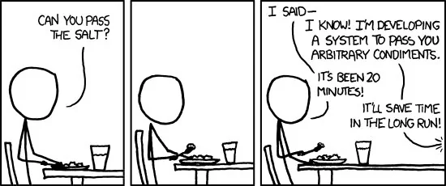

# **Why Most Agencies Over-Engineer Projects — And How to Build Only What You Need**

*By Jake Ngatchu (Piranha Studios)*

Most agencies won’t admit this, but I will:
**90% of digital projects don’t fail because of technology — they fail because people build far more than they actually need.**

Not more value.
Not more clarity.
Just… more stuff.

Unnecessary features.
Bloated architecture.
Complicated systems no one asked for.
Integrations nobody uses.
Dashboards because “it looks cool.”
A CMS for three pages of content.
AI because “investors will like it.”

It’s madness.

And the client always pays for the over-engineering in two ways:
**more upfront costs** and **long-term operational debt.**

Let’s break down why this happens and, more importantly, how to avoid it completely.

---

# **1. Agencies confuse *complexity* with *competence***

The industry is addicted to the idea that **bigger = better**.

Big diagrams.
Big workflows.
Big architecture decks.

But here’s the truth:

> **Complexity isn’t expertise. Execution is expertise.**

I’ve seen dev teams brag about microservices for a business that has 12 daily users.
I’ve seen startups burn £50,000 before selling a single product.
I’ve seen SaaS founders build admin panels they don’t even need yet.

People build complexity to *justify* their costs.

Clients mistake complexity for professionalism.
Agencies exploit that.

---

# **2. Over-engineering starts when the discovery is weak**

If your discovery phase is basically just:

* “What do you want?”
* “Okay, we’ll build it.”

…it’s already over-engineered.

Why?

Because most founders don’t need what they *think* they need.
They list symptoms, not causes.

Example:
A client says they want “a full CRM.”
What they actually need is:

* automated follow-ups
* a pipeline view
* task reminders

Not Salesforce.
Not HubSpot enterprise.
Not a 6-month dev build.

Just the core functionality.

This is why Piranha uses two types of discovery:

* **4 hours** for small projects
* **2 weeks** for complex ones

You figure out the real need before you write a single line of code.

---

# **3. Good tech solves a business problem. Bad tech creates them.**

When you build more than you need:

* every feature becomes another thing to maintain
* every integration becomes a future failure point
* every user flow becomes another training burden
* every decision becomes harder to reverse

The client ends up with:

* higher costs
* more bugs
* more confusion
* more delays

And ironically…
**a slower business.**

The goal is not to build a “big system.”
The goal is to build a system that moves the business forward.

---

# **4. The truth: 80% of projects only need a strong MVP with disciplined boundaries**

Here’s what most businesses actually need to launch:

* A clean backend
* 1–2 core features done properly
* A simple admin interface
* A clear workflow
* A few key integrations
* A roadmap for later

That’s it.

They don’t need:

* microservices
* Kubernetes
* custom analytics engines
* 10 different user roles
* real-time everything
* blockchain
* AI “assistants” to show off
* custom CMS logic for three blogs
* full Figma prototypes before a single MVP screen exists

Most of this is ego-driven, not value-driven.

---

# **5. How to build *only what you need*: the Piranha Method**

This is how I run projects now — no stress, no waste.

### **Step 1: Strip the business to the core objective**

“What is the ONE job the system must do perfectly?”

If we can’t answer that, we don’t build.

---

### **Step 2: Define the shortest path to money**

If a feature doesn't:

* generate revenue
* reduce workload
* or improve customer experience

…it’s Phase 2.

---

### **Step 3: Build the spine, not the skeleton**

Every business system has a spine — a single core flow.

For e-commerce → product → checkout → fulfilment.
For clinics → intake → appointment → notes → billing.
For data platforms → ingestion → processing → insights.

Build the spine first.
If the spine works, everything else can come later.

---

### **Step 4: Use a modern, lean stack**

This is why my studio uses:

* Supabase
* Go
* Next.js
* Zustand
* tRPC
* Medusa or Mercur
* Axiom
* Render

Not because it’s trendy — because it’s **fast**, **cheap to run**, and **scales cleanly**.

---

### **Step 5: Document the reality, not the fantasy**

We create a blueprint **people can execute** — not a pitch deck for investors.

Real workflows.
Real data structures.
Real constraints.
Real scope.

When your spec reflects the real world, your build does too.

---

# **6. The result: systems that actually work — and businesses that actually grow**

When you cut the noise:

* projects become cheaper
* timelines get shorter
* features launch faster
* clients understand what they’re paying for
* devs stop drowning in complexity
* and the business wins

The goal isn’t to build the most complicated system.

The goal is to build the **smallest system that delivers the biggest impact.**

That’s how you avoid over-engineering
— and build products that actually change something.
